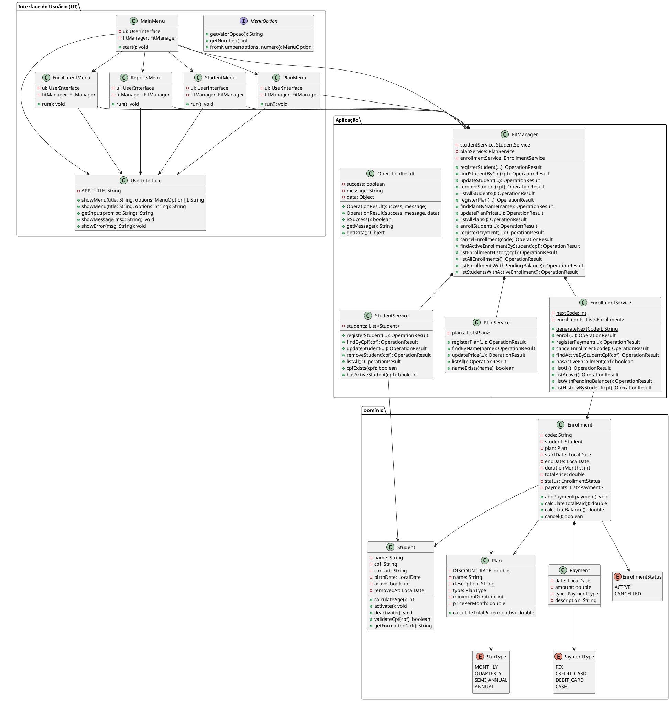

# FitManager — Relatório de Projeto
### Programação Orientada a Objetos — Etapa 1

---

## 1. Introdução

O FitManager é um sistema de gestão de academia desenvolvido em Java 17 como projeto da disciplina de Programação Orientada a Objetos. O sistema permite o gerenciamento de alunos, planos, matrículas e pagamentos por meio de uma interface interativa baseada em JOptionPane.

Nesta primeira etapa, foram implementadas todas as funcionalidades essenciais do sistema: cadastro e consulta de alunos e planos, realização e cancelamento de matrículas, registro de pagamentos e geração de relatórios. O foco da entrega está na construção de uma base sólida, com responsabilidades bem separadas entre camadas, regras de negócio consistentes e código preparado para evoluir nas etapas seguintes.

---

## 2. Integrantes e Contribuições

| Integrante | Contribuição Principal |
|---|---|
| Gabriel Felipe Barbosa | Participou de todas as etapas do desenvolvimento — domínio, serviços, menus e integração entre camadas |
| Marcelle Luna Souza | Participou de todas as etapas do desenvolvimento — domínio, serviços, menus e integração entre camadas |

O trabalho foi realizado de forma colaborativa, sem divisão rígida por área. Ambos os integrantes contribuíram com código nas três camadas da arquitetura ao longo do desenvolvimento. As contribuições individuais podem ser verificadas no histórico de commits do repositório.

---

## 3. Diagrama de Classes Final

O diagrama abaixo reflete o sistema conforme implementado nesta etapa. As principais diferenças em relação ao diagrama original são descritas na seção de Decisões de Projeto.

---

## 4. Decisões de Projeto

Esta seção documenta as principais decisões tomadas durante o desenvolvimento, as alternativas consideradas e as justificativas para cada escolha.

---

### 4.1 Interface de usuário: JOptionPane em vez de terminal

**Decisão:** Utilizar JOptionPane para toda a interação com o usuário.

**Alternativas consideradas:**
- Terminal (Scanner + System.out), conforme sugerido como opção padrão no documento.
- JOptionPane, permitido explicitamente pelo enunciado.

**Justificativa:** O JOptionPane oferece caixas de diálogo padronizadas do sistema operacional, tornando a experiência de uso mais intuitiva e menos suscetível a erros de entrada — por exemplo, o botão "Cancelar" retorna `null` de forma explícita, o que facilita o tratamento de desistência do usuário em qualquer ponto da navegação.

**Impacto:** Toda a lógica de I/O está encapsulada na classe `UserInterface`, exatamente como exigido pelo documento. Migrar para terminal na etapa 2 exige alterações apenas nessa classe.

---

### 4.2 Nome da classe de I/O: `UserInterface` em vez de `UserScreen`

**Decisão:** A classe foi renomeada de `UserScreen` (nome inicial de desenvolvimento) para `UserInterface`, alinhando com o diagrama oficial do projeto.

**Impacto:** Nenhum — a renomeação foi feita antes de qualquer dependência se consolidar. O nome `UserInterface` está consistente em todo o código.

---

### 4.3 Armazenamento do CPF sem formatação

**Decisão:** O CPF é armazenado internamente apenas com dígitos (`12345678900`), sem pontos ou hífen.

**Alternativas consideradas:**
- Armazenar com formatação (`123.456.789-00`), facilitando a exibição.
- Armazenar sem formatação e formatar apenas na exibição via `getFormattedCpf()`.

**Justificativa:** Armazenar sem formatação simplifica todas as operações de busca e comparação — não é necessário normalizar a entrada antes de cada `equals()`. A formatação para exibição é feita pelo método `getFormattedCpf()` em `Student`, mantendo a responsabilidade de apresentação separada do dado bruto.

**Impacto:** Toda entrada de CPF recebida pela interface passa por `replaceAll("[^0-9]", "")` antes de qualquer operação. A consistência é garantida tanto nos serviços quanto no `FitManager`.

---

### 4.4 Validação completa do CPF com dígito verificador

**Decisão:** Implementar o algoritmo completo de validação do CPF, incluindo os dois dígitos verificadores pelo módulo 11.

**Alternativas consideradas:**
- Validar apenas comprimento e caracteres numéricos (mais simples, menos robusto).
- Validação completa com dígito verificador (mais robusta).

**Justificativa:** A validação básica aceitaria CPFs como `11111111111` ou `00000000000`, que são numericamente bem formados mas inválidos. O algoritmo completo rejeita esses casos e garante que apenas CPFs genuinamente válidos entrem no sistema. O método `validateCpf()` é estático em `Student`, pois a validação de formato não depende de nenhum atributo de instância.

**Impacto:** Maior robustez no cadastro de alunos. CPFs com todos os dígitos iguais são explicitamente rejeitados antes do cálculo dos verificadores.

---

### 4.5 Estratégia de remoção de alunos: inativação lógica

**Decisão:** Alunos não são removidos fisicamente da lista — são marcados como inativos via `deactivate()`, que registra a data de remoção em `removedAt`.

**Alternativas consideradas:**
- Remoção física: simples, mas deixa referências inválidas nos objetos `Enrollment` que apontam para o `Student` removido.
- Inativação lógica: o objeto continua existindo em memória com `active = false`, preservando a integridade do histórico de matrículas.

**Justificativa:** A inativação preserva o histórico de matrículas sem criar referências pendentes. O atributo `removedAt` documenta quando a remoção ocorreu. As listagens de alunos filtram apenas os ativos, mantendo a visibilidade operacional correta.

**Impacto:** O método `cpfExists()` em `StudentService` verifica ativos e inativos — um CPF de aluno inativo não pode ser reutilizado. Isso garante unicidade permanente do CPF no sistema.

---

### 4.6 `totalPrice` calculado e fixado na criação da matrícula

**Decisão:** O valor total da matrícula é calculado uma única vez no construtor de `Enrollment` via `plan.calculateTotalPrice(durationMonths)` e armazenado em `totalPrice`. Ele nunca é recalculado após esse ponto.

**Alternativas consideradas:**
- Calcular dinamicamente sempre que necessário, buscando o preço atual do plano.
- Calcular e armazenar no momento da criação (escolha adotada).

**Justificativa:** O contrato firmado no momento da matrícula deve refletir o preço vigente naquele instante. Alterar o preço de um plano não deve retroagir sobre contratos já existentes — isso seria uma violação do princípio de consistência histórica. A abordagem adotada garante que `Enrollment.totalPrice` seja imutável após a criação.

**Impacto:** O fluxo de alteração de preço (`updatePlanPrice`) atualiza apenas o atributo `pricePerMonth` do objeto `Plan`, sem propagar nenhuma mudança para matrículas existentes. Isso é verificável: uma matrícula criada com preço R$ 100/mês mantém seu `totalPrice` mesmo após o plano ser atualizado para R$ 150/mês.

---

### 4.7 Regra do pagamento inicial: valor positivo obrigatório

**Decisão:** A matrícula só é efetivada após o registro de um pagamento inicial com valor positivo. Qualquer valor positivo é aceito — não há exigência de valor mínimo proporcional ao total.

**Alternativas consideradas:**
- Exigir pagamento de ao menos uma parcela (valor total / duração).
- Exigir um percentual do valor total (ex: 10%).
- Exigir qualquer valor positivo (escolha adotada).

**Justificativa:** Exigir um valor mínimo específico adiciona complexidade sem justificativa clara no domínio descrito. A regra fundamental do enunciado é que a matrícula não pode existir sem ao menos um pagamento registrado. A política de parcelas pode ser definida por fora do sistema. Pagamentos parciais são permitidos explicitamente pelo documento.

**Impacto:** O `FitManager` valida o valor positivo antes de delegar ao `EnrollmentService`. O `EnrollmentService` cria `Enrollment` e `Payment` inicial de forma atômica — se qualquer validação falhar, nenhum objeto entra na coleção.

---

### 4.8 Atomicidade da criação de matrícula e pagamento inicial

**Decisão:** `Enrollment` e `Payment` inicial são criados dentro de uma única chamada a `EnrollmentService.enroll()`. O objeto `Enrollment` só é adicionado à coleção após o `Payment` ter sido criado e registrado com sucesso.

**Justificativa:** Evita o estado intermediário em que a matrícula existe sem nenhum pagamento — o que violaria a regra de negócio. Se a criação do `Payment` falhar (ex: tipo nulo), o `Enrollment` não é adicionado à lista e nenhum efeito colateral persiste.

**Impacto:** O fluxo de matrícula coleta todos os dados — incluindo os do pagamento inicial — antes de qualquer chamada ao `FitManager`. O menu não toma nenhuma decisão após a chamada: apenas exibe o `OperationResult` recebido.

---

### 4.9 Cancelamento como operação irreversível com retorno booleano

**Decisão:** O método `cancel()` em `Enrollment` retorna `boolean` — `true` se o cancelamento foi executado, `false` se a matrícula já estava cancelada.

**Alternativas consideradas:**
- Retornar `void` e deixar a verificação de status no serviço.
- Retornar `boolean` e verificar no objeto (escolha adotada).

**Justificativa:** A regra "CANCELLED é irreversível" pertence ao objeto `Enrollment`, que conhece seu próprio estado. O retorno booleano permite que o `EnrollmentService` monte um `OperationResult` descritivo sem precisar duplicar a lógica de verificação. A transição de estado acontece no objeto; a interpretação do resultado acontece no serviço.

**Impacto:** O status `CANCELLED` nunca é revertido. O `EnrollmentService.cancelEnrollment()` trata o retorno `false` retornando um `OperationResult` com mensagem `"Esta matrícula já está cancelada."`.

---

### 4.10 Instanciação dos submenus: lazy instantiation

**Decisão:** Os submenus (`StudentMenu`, `PlanMenu`, `EnrollmentMenu`, `ReportsMenu`) são instanciados sob demanda no `MainMenu`, apenas quando o usuário acessa a opção correspondente pela primeira vez.

**Alternativas consideradas:**
- Instanciar todos os submenus no construtor do `MainMenu`.
- Instanciar sob demanda com reutilização nas chamadas seguintes (lazy instantiation — escolha adotada).

**Justificativa:** A lazy instantiation evita criar objetos que o usuário pode nunca utilizar na sessão. Uma vez criado, o submenu é reutilizado, mantendo referência única ao `UserInterface` e ao `FitManager`. A abordagem é simples, suficiente para esta etapa e não introduz complexidade desnecessária.

**Impacto:** O `MainMenu` mantém atributos privados para cada submenu, inicializados como `null`. Getters privados verificam `null` e instanciam quando necessário.

---

### 4.11 Desconto de 10% em meses excedentes (funcionalidade extra)

**Decisão:** O método `calculateTotalPrice(months)` em `Plan` aplica desconto de 10% sobre os meses que excedem a duração mínima do plano.

**Alternativas consideradas:**
- Preço fixo para todos os meses (`pricePerMonth * months`).
- Desconto progressivo por tipo de plano (usando `if (type == QUARTERLY)`).
- Desconto sobre os meses excedentes independente do tipo (escolha adotada).

**Justificativa:** A regra é simples e coerente com o domínio — contratos mais longos têm incentivo financeiro. A lógica foi colocada em `Plan.calculateTotalPrice()`, que é exatamente o ponto indicado pelo documento para esta funcionalidade. Não foi usada lógica condicional por `PlanType` — o desconto é uniforme para todos os tipos, evitando o `if/else` que o documento sinaliza como candidato a subclasse na etapa 2.

**Impacto:** O `totalPrice` de qualquer matrícula com duração superior ao mínimo do plano já reflete o desconto. Por ser calculado e fixado no construtor de `Enrollment`, o desconto é parte imutável do contrato — alterações futuras na política de desconto não afetam matrículas existentes.

---

### 4.12 Situação financeira como cálculo, não como estado

**Decisão:** A situação financeira de uma matrícula (quitada, pendente, crédito) não é armazenada como atributo separado — é derivada dinamicamente por `calculateBalance()` sempre que necessária.

**Alternativas consideradas:**
- Armazenar como enum de estado (`PAID`, `PENDING`, `CREDIT`), simplificando consultas.
- Calcular dinamicamente a partir de `totalPrice` e da lista de pagamentos (escolha adotada).

**Justificativa:** Armazenar o estado financeiro como atributo separado cria risco de inconsistência — o estado poderia ficar desatualizado se um pagamento fosse adicionado sem atualizar o enum. Como `calculateBalance()` opera sobre os dados sempre presentes em `Enrollment`, o resultado é sempre correto por definição. Um valor positivo indica saldo pendente; zero ou negativo indica quitação ou crédito.

**Impacto:** Nenhuma operação de pagamento precisa atualizar um estado financeiro separado. O menu exibe o saldo chamando `calculateBalance()` diretamente após cada pagamento.

---

### 4.13 Crédito: exibição informativa sem bloqueio

**Decisão:** Quando o total pago supera o valor da matrícula (`calculateBalance() < 0`), o sistema exibe o crédito como informação mas não bloqueia novos pagamentos.

**Justificativa:** Uma academia pode aceitar pagamentos antecipados de meses futuros ou cobranças parciais que excedam o valor original. Bloquear pagamentos quando há crédito limitaria cenários legítimos. O comportamento adotado é informativo: o saldo negativo é exibido como "crédito" nas listagens e no menu de pagamento.

---

### 4.14 Coordenação entre serviços centralizada no FitManager

**Decisão:** Os serviços nunca se comunicam diretamente entre si. Toda coordenação que envolve mais de um serviço é responsabilidade do `FitManager`.

**Exemplos concretos:**
- `removeStudent()`: `FitManager` consulta `EnrollmentService.hasActiveEnrollment()` antes de delegar ao `StudentService`.
- `enrollStudent()`: `FitManager` localiza o aluno e o plano nos serviços correspondentes antes de delegar ao `EnrollmentService`.
- `listStudentsWithActiveEnrollment()`: `FitManager` cruza dados de `StudentService` e `EnrollmentService`.

**Justificativa:** Serviços que se comunicam diretamente criam acoplamento circular e dificultam manutenção. O `FitManager` como orquestrador único mantém cada serviço coeso e focado apenas em sua própria entidade.

---

### 4.15 Organização dos enums de menu em subpacotes

**Decisão:** Cada menu tem seu próprio enum de opções (`MainMenuOption`, `StudentMenuOption`, etc.) dentro do mesmo subpacote do menu correspondente.

**Justificativa:** Mantém a coesão entre o menu e suas opções — `PlanMenu` e `PlanMenuOption` estão no mesmo pacote `ui.menus.plan`. A interface `MenuOption` fornece o contrato comum (`getNumber()`, `getValorOpcao()`, `fromNumber()`), permitindo que `UserInterface.showMenu()` aceite qualquer enum de menu sem conhecer o tipo específico.

---

## 5. Regras de Negócio Implementadas

| Regra | Onde está implementada |
|---|---|
| CPF único no sistema | `StudentService.cpfExists()` — verificado antes de criar o `Student` |
| CPF inativo não pode ser reutilizado | `StudentService.cpfExists()` — verifica ativos e inativos |
| Todos os campos obrigatórios | Validações de nulo/vazio no início de cada método dos serviços |
| Validação de CPF com dígito verificador | `Student.validateCpf()` — chamado pelo `StudentService` |
| Aluno só removível sem matrícula ativa | `FitManager.removeStudent()` — consulta `EnrollmentService` antes de delegar |
| Nome do plano único | `PlanService.nameExists()` — verificado antes de criar o `Plan` |
| Duração mínima > 0 | `PlanService.registerPlan()` |
| Preço > 0 | `PlanService.registerPlan()` e `PlanService.updatePrice()` |
| Um aluno não pode ter duas matrículas ativas | `FitManager.enrollStudent()` — consulta `EnrollmentService.hasActiveEnrollment()` |
| Duração >= mínimo do plano | `EnrollmentService.enroll()` |
| `totalPrice` calculado e fixado na criação | `Enrollment` (construtor) — nunca recalculado |
| Matrícula efetivada só após pagamento inicial | `EnrollmentService.enroll()` — cria `Enrollment` e `Payment` atomicamente |
| Pagamento não permitido em matrícula cancelada | `EnrollmentService.registerPayment()` — verifica status antes de registrar |
| Alteração de preço não afeta matrículas existentes | Por design: `totalPrice` é armazenado em `Enrollment`, não calculado do plano |
| `CANCELLED` é irreversível | `Enrollment.cancel()` — verifica status atual e retorna `false` se já cancelada |
| Desconto de 10% em meses excedentes | `Plan.calculateTotalPrice()` |

---

## 6. Funcionalidades Extras

### Desconto progressivo por duração contratada

**O que foi implementado:** O método `Plan.calculateTotalPrice(months)` aplica desconto de 10% sobre os meses que excedem a duração mínima do plano. Os meses dentro da duração mínima são cobrados pelo preço cheio.

**Exemplo:**
- Plano Mensal: mínimo 1 mês, R$ 100,00/mês
- Contratado por 12 meses: `1 × R$100 + 11 × R$90 = R$ 1.090,00`

**Classes criadas ou modificadas:** apenas `Plan.calculateTotalPrice()`.

**Decisão de projeto:** A lógica de desconto está em `Plan`, que é o objeto responsável pelo cálculo de preço. Não foi usada lógica condicional por `PlanType` — o desconto é uniforme. Isso é intencionalmente simples: na etapa 2, quando `PlanType` der origem a subclasses de `Plan`, cada subclasse poderá sobrescrever `calculateTotalPrice()` com sua própria política de desconto, eliminando a estrutura `if/else` que existiria se o desconto fosse diferente por tipo agora.

---

## 7. Dificuldades e Aprendizados

### Principal dificuldade: escrita de código em blocos grandes antes de separar

A maior dificuldade técnica do projeto foi a tendência de construir partes extensas do código antes de separar responsabilidades entre as camadas. Em alguns momentos, funcionalidades foram escritas de forma acoplada — lógica de negócio misturada com interação ou coordenação — e só depois foram refatoradas para as camadas corretas.

Essa abordagem gerou retrabalho: mover código entre classes depois que ele já tem dependências consolidadas é mais custoso do que posicioná-lo corretamente desde o início. O aprendizado concreto é que, em projetos com arquitetura em camadas, a separação deve ser feita incrementalmente — implementar um fluxo completo de ponta a ponta (menu → FitManager → serviço → domínio) antes de avançar para o próximo, em vez de construir toda uma camada de uma vez.

### O que faríamos diferente

Se começássemos o projeto do zero, adotaríamos um ritmo de desenvolvimento por fluxo completo: implementar o Fluxo 1 do início ao fim (menu, FitManager, serviço, domínio), verificar que funciona, depois avançar para o Fluxo 2. Isso teria reduzido o retrabalho de separação e evidenciado mais cedo eventuais problemas de acoplamento entre camadas.

### Aprendizados sobre arquitetura em camadas

O projeto tornou concreto o impacto de manter fronteiras claras entre camadas. Toda vez que uma regra de negócio "escapava" para um menu ou uma chamada de serviço aparecia em dois lugares diferentes, o custo de manutenção aumentava de forma visível. A disciplina de fazer tudo passar pelo `FitManager` — mesmo quando parecia mais rápido acessar o serviço diretamente — comprovou seu valor nas situações em que a lógica de coordenação precisou ser ajustada: a mudança ficou localizada em um único ponto.

---

*Relatório produzido para a disciplina de Programação Orientada a Objetos — Etapa 1 | Prazo: 15 de abril*